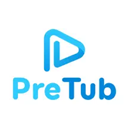

  

<h2 align="center">Pretub Store</h2>

  
  
  

  <em>A transparent, serverless app store powered entirely by GitHub</em> 
  <em>Built for automation, trust, and community driven distribution</em>

  
  

  

  

  
  
  
  
  

---

## Overview 🌌

**Orion Store** is a modern, serverless app store that relies completely on GitHub repositories and GitHub Actions.

There is no centralized backend, no opaque process, and no hidden uploads.  
Apps are fetched directly from their source repositories, updates are tracked automatically, and everything remains publicly auditable.

---

## Key Highlights ⚡

- Fully serverless architecture  
- One click app downloads  
- Automatic update detection and notifications  
- No ads inside the app  
- Automatic APK cleanup after installation  
- Extremely lightweight, around 5 to 6 MB  
- Web wrapped but feels close to native  
- Built with transparency and community trust in mind  

---

  
  
<i>Click the image above to watch the demo video</i>

---

## Screenshots 📸

  <h3>App Screenshots</h3>
  <table>
    <tr>
      <td></td>
      <td></td>
      <td></td>
    </tr>
    <tr>
      <td></td>
      <td></td>
      <td></td>
    </tr>
  </table>

  Tap any image to view full size

---

## Architecture and Transparency 🔍

Orion is built around openness.

### App Warehouse

All apps live in the **[Orion Data](https://github.com/RookieEnough/Orion-data)** repository.

- `app.json` contains the full app catalog  
- Apps are added through community pull requests  
- No manual uploads or private binaries  

### Smart API Handling

- `mirror.json` intelligently bypasses GitHub API rate limits  
- Ensures stability even under heavy usage  

Every step is visible, reviewable, and reproducible.

---

## Themes 🎨

Orion supports multiple themes:

- Light  
- Dark  
- Dusk  
  A custom theme introduced with its own identity  

---

## Developer Mode 🛠️

Orion includes a hidden **Developer Mode** designed for power users.

### Unlock Method

- Tap the **Orion Store** header 8 times  

### Developer Features

- Advanced debugging options  
- App metadata inspection  
- Manual refresh and diagnostics  
- GitHub API configuration  

### Personal Access Token Support

Users can add their own GitHub **Personal Access Token** inside Developer Mode.

- Default API limit: 60 requests per hour  
- With PAT: up to 5000 requests per hour  

This improves performance without compromising transparency.

---

## Gamification and Badges 🏆

Orion includes **8 cosmetic badges**.

- Each badge has a unique hidden unlock condition  
- No public hints or documentation  
- Encourages exploration and curiosity  

Badges are purely cosmetic and do not affect app functionality.

---

## Supporting Development ❤️

Orion does not force monetization.

Users can support development in two optional ways:

### Buy Me a Coffee

### Fuel The Code
A gamified system where users support the project by watching ads.

- Completely optional  
- No forced ads  
- Designed to be respectful and fun  

---

## Related Project

### [Morphe Auto Builds](https://github.com/RookieEnough/morphe-AutoBuilds)

- Built automatically using GitHub Actions  
- Uses the official Morphe CLI patcher  
- No manual uploads  
- Fully transparent and reproducible builds  

This project integrates cleanly with Orion Store.

---

## Contribution 🤝

Contributions are welcome.

- Submit new apps via Orion Data  
- Improve metadata or structure  
- Open pull requests for enhancements  

Help grow a clean, community driven app ecosystem.

---

## License 📄

Orion Store is licensed under the **MIT License**.

---

  Made with 💜 by <strong>RookieZ</strong>

